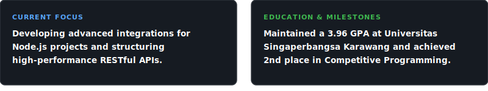

  

<h1 align="center">Masami Yuu</h1>

<strong>Software Engineer | Back-End Specialist | Computer Science Student</strong>

  

---

### About Me

An Informatics student focusing on Back-End Development and Software Engineering. Experienced in building robust RESTful APIs, managing relational and non-relational databases, and integrating IoT hardware systems with interactive web dashboards. Actively contributing to the academic community as a Software Engineer Laboratory Assistant and technical mentor.

  

- **Roles:** Serving as a Laboratory Assistant in the Software Engineering division and mentoring web development at Himtika Study Club.

---

### Connect with Me

  
  
  
  

---

### Core Specialties and Technology Stack

**Languages**

  
  
  
  
  
  
  

**Frameworks and Libraries**

  
  
  
  
  

**Databases and Tools**

  
  
  
  
  
  
  

**Design**

  
  

---

### Featured Projects

**Edukasild Web Platform**
An interactive digital repository for educational material built using React, Tailwind CSS, and Node.js. Optimized for intuitive UI navigation and high performance.

  
  
  

**IoT Smart Attendance System**
A real-time attendance simulator using ESP32, RFID-RC522, and RTC. Features an integrated live web dashboard built with PHP and MySQL displaying attendance logs and system status.

  
  
  

**G-Stock POS Desktop App**
An offline-first desktop Point of Sale (POS) system built using JavaFX and JDBC to manage live product inventory, transaction workflows, and stock tracking records.

  
  

---

### GitHub Statistics

  
  

  

  

  

---

  

  

